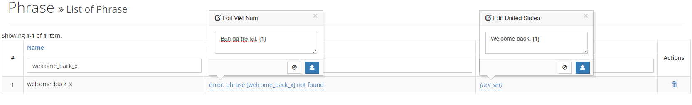

#Translate
## Simple usage
### In code
```
<?php
echo \navatech\language\Translate::welcome_to_my_website();
//or
$translate = new \navatech\language\Translate();
echo $translate->welcome_to_my_website;
```
Then run the page where contain above code

### Output
* First output
```
in English: "Error: Phrase [welcome_to_my_website] not found"
in Vietnamese: "Error: Phrase [welcome_to_my_website] not found"
```
Go to http://localhost/language/phrase & update missing phrases.
* Finally output
```
in English: "Welcome to my website"
in Vietnamese: "Chào mừng bạn ghé thăm trang của tôi"
```
## Usage with parameters:
```
<?php
echo \navatech\language\Translate::welcome_back_x([
    Yii::$app->user->identity->username
]);
//or
$translate = new \navatech\language\Translate();
echo $translate->welcome_back_x([
    Yii::$app->user->identity->username
]);
```
Then run the page where contain above code

### Output
* First output
```
in English: "Error: Phrase [welcome_back_x] not found"
in Vietnamese: "Error: Phrase [welcome_back_x] not found"
```
Go to http://localhost/language/phrase & update missing phrases.


* Finally output
```
in English: "Welcome back, Jennifer Melzer"
in Vietnamese: "Bạn đã trở lại, Jennifer Melzer"
```
